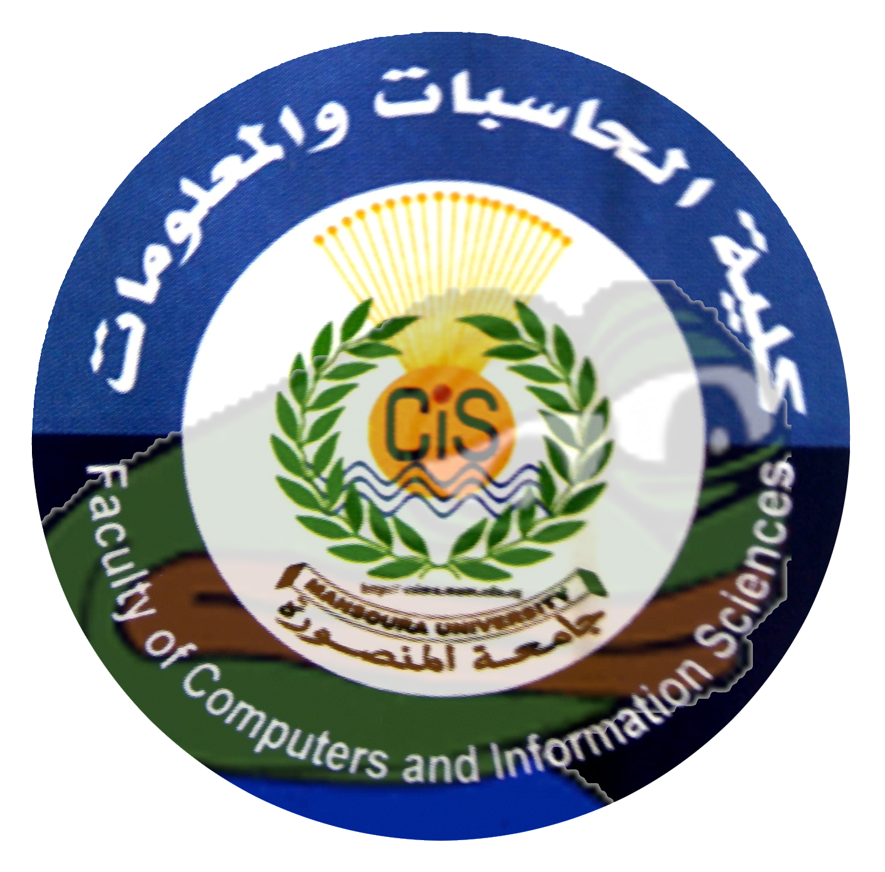

# FCISDeptsCourses
A comprehensive list of FCIS-MU courses (General - 3rd and 4th).

| CS                                    | IT                                          | IS                                   |
|---------------------------------------|---------------------------------------------|--------------------------------------|
| [Software Engineering I](#software-engineering-i)                | [Computer Networks](#computer-networks)                           | [Computer Networks](#computer-networks)                    |
| [Design and Analysis of Algorithms](#design-and-analysis-of-algorithms)     | [Software Engineering](#software-engineering)                        | [Information Theory](#information-theory)                                  |
| [Assembly](#assembly)                              | [Databases II](#databases-ii)                                | [Databases II](#databases-ii)                         |
| [Computer Network and Security](#computer-network-and-security)         | [Electronics](#electronics)                                 | [System Analysis](#system-analysis)                      |
| [Software Engineering II](#software-engineering-ii)               | [Research Methods in Computer Science](#research-methods-in-computer-science)        | [Research Methods in Computer Science](#research-methods-in-computer-science) |
| [AI I](#ai-i)                                  | [Fuzzy Logic](#fuzzy-logic)                                 | [Intelligent Information Systems](#intelligent-information-systems)      |
| [Digital Signal Processing](#digital-signal-processing)             | [Image Processing](#image-processing)                            | [E-Commerce](#e-commerce)                           |
| [Program Language Design](#program-language-design)               | [Network Programming](#network-programming)                         | [Network Programming](#network-programming)                  |
| [Operating Systems II](#operating-systems-ii)                  | [Human-Computer Interaction](#human-computer-interaction)                  | [System Design and Implementation](#system-design-and-implementation)                        |
| [Natural Language Processing](#natural-language-processing)           | [Multimedia](#multimedia)                                  | [Multimedia](#multimedia)                           |
| [Distributed Systems](#distributed-systems)                   | [Mobile Banking](#mobile-banking)                              | [Mobile Banking](#mobile-banking)                       |
| [AI II](#ai-ii)                                 | [Pattern Recognition](#pattern-recognition)                         | [Distrebuted Databases](#distributed-database-systems)                |
| [Knowledge Systems](#knowledge-systems)                     | [Bioinformatics](#bioinformatics)                              | [Project Management](#project-management)                   |
| [Compiler Design](#compiler-design)                       | [Computer Security](#computer-security)                           | [Computer Security](#computer-security)                    |
| موضوعات مختارة فى علوم الحاسب_733     | [Data Mining](#data-mining)                                 | [Data Mining](#data-mining)                          |
| تعريب الحاسبات و تكنولوجيا اللغات_737 | [Introduction to Microcomputers Applications](#introduction-to-microcomputer-applications) | [Geographic Information Systems](#geographic-information-systems)       |
| اختيارى كلية ( 1 )_711                | موضوعات مختارة فى تكنولوجيا المعلومات_774   | موضوعات مختارة فى نظم المعلومات_752  |
| اختيارى كلية ( 2 )_734                | اختيارى الكلية -1_765                       | اختيارى الكلية -1_730                |
| اختيارى الكلية -3_738                 | اختيارى كلية -2_770                         | اختيارى الكلية -2_748                |
| اختيارى الكلية -4_739                 | اختيارى كلية -3_775                         | اختيارى الكلية -3_753                |

**NOTE:** To keep it real, I planned to take the syllabus from previous versions of FCIS-MU courses (official lecture notes, professors' GitHub repos, and lecture slides). I was trying to get as close to the official FCIS-MU material.

**NOTE:** Courses tagged with **\[EXTERNAL\]** means the syllabus is taken from the internet. It should be close enough to the official FCIS-MU material. 

**NOTE:** The syllabus is subject to change.

**NOTE:** You're more than welcome to contribute to the repo -- especially if you spot any mistakes!

### Software Engineering I 
https://en.wikipedia.org/wiki/Software_engineering
#### Course Syllabus
- Chapter 1: Introduction.
    1. Professional software development.
    2. Software engineering ethics.
    3. Case studies.
- Chapter 2: Software Processes.
    1. Software process models.
    2. The Rational Unified Process.
    3. Agile Software Development.
- Chapter 3: Agile Software Development.
    1. Agile methods.
    2. Agile development techniques.
    3. Agile project management.
- Chapter 4: Requirements Engineering.
    1. Requirements engineering process.
    2. Requirements elicitation and analysis.
    3. Requirements validation.
- Chapter 6: Business Model.
    1. Business modeling.

#### References
- Software Engineering 9th Edition by Ian Sommerville

### Design and Analysis of Algorithms 
https://en.wikipedia.org/wiki/Analysis_of_algorithms

#### Course Syllabus \[EXTERNAL\]
1. Introduction to Algorithms
    1. Overview of algorithms and their importance
    2. Characteristics and properties of efficient algorithms
    3. Analysis of algorithm efficiency
    4. Asymptotic notation and its significance in algorithm analysis
2. Divide and Conquer Algorithms
    1. Divide and conquer strategy and its application in algorithms
    2. Merge sort and quicksort algorithms
    3. Strassen's matrix multiplication algorithm
    4. Analysis of divide and conquer algorithms
3. Greedy Algorithms
    1. Greedy strategy and its application in algorithms
    2. Huffman coding algorithm
    3. Kruskal's and Prim's algorithms for minimum spanning trees
    4. Dijkstra's algorithm for shortest paths
    5. Analysis of greedy algorithms
4. Dynamic Programming
    1. Dynamic programming concept and its application in algorithms
    2. Fibonacci sequence using dynamic programming
    3. Knapsack problem and its dynamic programming solution
    4. Bellman-Ford algorithm for single-source shortest paths
    5. Analysis of dynamic programming algorithms
5. Network Flow Algorithms
    1. Flow networks and basic network flow concepts
    2. Ford-Fulkerson method and Edmonds-Karp algorithm for maximum flow
    3. Bipartite matching algorithms
    4. Analysis of network flow algorithms
6. NP-Completeness and Approximation Algorithms
    1. Introduction to NP-completeness and complexity classes
    2. Cook's theorem and polynomial-time reductions
    3. Approximation algorithms and their design techniques
    4. Approximation algorithms for NP-complete problems
    5. Analysis of approximation algorithms
7. Randomized Algorithms
    1. Randomized algorithm concept and advantages
    2. Randomized quicksort algorithm
    3. Randomized algorithms for selection and searching
    4. Analysis of randomized algorithms
8. Parallel and Distributed Algorithms
    1. Basics of parallel and distributed computing
    2. Parallel algorithms for sorting and searching
    3. Distributed algorithms for resource allocation and consensus
    4. Analysis of parallel and distributed algorithms
9. Algorithmic Techniques for Special Problems
    1. String matching algorithms
    2. Geometric algorithms
    3. Graph algorithms (e.g., topological sorting, shortest paths)
    4. Number theoretic algorithms
    5. Analysis of algorithms for special problems
10. Advanced Topics in Algorithm Design and Analysis
    1. Approximation schemes and parameterized complexity
    2. Online algorithms and competitive analysis
    3. External memory algorithms
    4. Quantum algorithms and their analysis

### Logic Programming 
https://en.wikipedia.org/wiki/Logic_programming

#### Course Syllabus
- Chapter 1: Introduction to Logic Programming
    1. Human Logic
    2. Formal Logic
    3. Computational Logic
    4. Applications of logic
- Chapter 2: Propositional Logic
    1. The Language of Propositional Logic
        1. Syntax and Formation Rules of PL
        3. Truth Functions and Truth Tables
        3. Definability of Operators and Languages PL' and PL''
        4. Tautologies, Logical Equivalence and Validity
    2. Deduction: Rules of Inference and Replacement
        1. Natural Deduction
        2. Rules of Inference
        3. Rules of Replacement
        4. Direct Deduction
        5. Conditional and Indirect Proofs
- Chapter 3: Predicate (Relational) Logic 30
    1. troduction to Predicate Logic
    2. Quantification: Forming Propositions from Predicates
    3. Well-Formed Formula for First Order Predicate Logic
    4. Wifto Proposition
    5. Reasoning with Pricate Logic
    6. Quantifiers and Connectives
- Chapter 4: Resolution
    1. Propositional Resolution...
        1. Clausal Form
        2. Propositional Resolution.
        3. Resolution Provability
    2. Predicate (Relational) Resolution.
        1. Unification.
        2. Clausal Form
    3. Resolution Principle
    4. Applications
    5. Strategies
- Chapter 5: Horn clause logic
    1. Backward Chaining (BC)
    2. Forward chaining(FC)
    3. Forward and Backward Chaining 
- Chapter 6: Introduction to Prolog
    1. Prolog Program Sections
        1. Clauses section
        2. Predicate Section
        3. Domains Section
        4. Goal Section
        5. Constants section
        6. Database Section
    2.  Techniques Behind Prolog
        1. Unification: Matching things up
        2. Backtracking: Finding all passible solutions by considering alternative paths
        3. Repetition
    3. List Processing
    4. Symbolic processing or String-Handling
    5. I/O and File Operations
        1. Writing
        2. Reading
        3. Prolog's File System

### Assembly 
https://en.wikipedia.org/wiki/Assembly_language
- Lecture 1:
    1. Why Assembly in 2021
    2. Levels of Programming.
    3. Instruction execution life cycle.
    4. Intel 8086 (x86 architecture).
    5. Addressing Data in Memory. 
- Lecture 2:
    1. Memory Segments and Addressing.
    2. CPU Registers.
    3. Operating System Features.
    4. BIOS BOOT Process.
    5. I/O Interface.
    6. Types of executable programs and program loader.
    7. Memory Stack.
- Lecture 3:
    1. Memory Stack.
    2. Instruction Execution and Addressing.
    3. Introduction to a DEBUG Program.
    4. DEBUG Commands.
    5. Working with DEBUG Tool.
    6. DEBUG D command.
    7. Explore BIOS Data Area with DEBUG D command.
    8. Explore BIOS ROM Date/copyright with DEBUG D command.
    9. DEBUG E command.
    10. DEBUG R command.
    11. DEBUG T command.
    12. DEBUG A command.
    13. DEBUG U command.
- Lecture 4:
    1. INT instruction.
    2. INT 21H, AH=2AH to Display the Current Date.
    3. INT 21H, AH=2CH to Display the Current Time.
    4. INT 21H, AH=09H to Display on the Screen.
    5. INT 16H, AH=10H to Accept characters from a keyboard .
    6. Using PTR operator.
    7. Introduction to GUI Assemblers'IDE.
- Lecture 5: 
    1. Assembly Language Syntax for Comments.
    2. Assembly Language Reserved Words.
    3. Assembly Language Syntax for Identifiers.
    4. Assembly Language Syntax for Instruction Statements.
    5. Assembly Language Syntax for Directive Statements.
- Lecture 6:
    1. Assembly Language Syntax for Simplified Directive Statements.
    2. Assembly Language Data Types.
    3. Assembly Language EQU Directive.
- Lecture 7:
    1. What is Compiler? Difference between Compiler, Assembler, Linker and Loader?
    2. How Assemblers interpret your code?
- Lecture 8:
    1. Data Transfer Instruction MOV.
    2. Data Transfer Instructions MOVSX and MOVZX.
    3. Data Transfer Instruction XCHG.
    4. Data Transfer Instruction LEA.
    5. Arithmetic Instructions: INC/DEC,ADD/SUB, DIV/MUL.
    6. A general introduction to a complete set of 8086 Instructions.
- Lecture 9:
    1. The story behind INT instruction.
    2. Register Addressing Mode.
    3. Immediate Addressing Mode.
    4. Direct Memory Addressing Mode.
    5. Direct-Offset Memory Addressing Mode.
    6. Indirect Memory Addressing Mode.
    7. Base Displacement Addressing Mode.
    8. Base-Index Addressing Mode.
    9. Base-Index with Displacement Addressing Mode.
    10. Segment Override Prefix.
    11. NEAR and FAR addresses.
- Lecture 10:
    1. SHORT, NEAR and FAR addresses.
    2. Backward and Forward JMP.
    3. LOOP,LOOPE,LOOPZ,LOOPNE,LOOPNZ.
    4. CMP instruction.
    5. Conditional JUMP instructions (signed/unsigned Data).
- Lecture 11:
    1. Call instruction.
    2. Passing Parameters by Values Vs. References.
    3. Boolean Operations (self study).
- Lecture 12:
    1. Binary Representation of Assembly Data Movement Instructions in 16-bit mode.
    2. Opcode bytes in 16-bit Instruction mode.
    3. MOD-REG-R/M bytes in 16-bit Instruction mode.
    4. Displacement bytes in 16-bit Instruction mode.
    5. Immediate bytes in 16-bit Instruction mode.

### Computer Network and Security 
https://en.wikipedia.org/wiki/Computer_network

#### Course syllabus
1. Physical and link layer communication: 
    - Media, signals, and bits.
    - Time division and frequency division multiplexing.
    - Encoding; modulation.
    - Delay, bandwidth, throughput, and noise.
    - Error correction techniques.
    - CSMA/CD.
    - CSMA/CA. 
    - Ethernet addressing and wiring.
    - Hubs.
2. Packet communication:
    - Local Area Network and Wide Area Network technologies. 
    - Token passing rings.
    - FDDI.
    - Wireless networks.
    - Network interconnection with repeaters, bridges, and switches.
    - DSU/CSU.
    - xDSL and cable modems.
    - Store-and-fonward.
    - Next-hop fonwarding.
3. Internetworking: 
    - Router-based architecture.
    - IP addressing.
    - Address binding with ARP.
    - Datagram encapsulation and fragmentation.
    - Link-state and distance-vector routing.
    - Dijkstra’s algorithm.
    - Network properbes.
    - Ownership and service paradigm.
    - UDP and TCP.
    - TCP segment format.
    - Adaptive retransmission.
    - Protocol ports.
    - ICMP and error handling.
4. Network applications: 
    - Client/server concept.
    - Port demultiplexing.
    - Socket API.
    - Server concurrency.
    - DNS.
    - TELNET.
    - Web technologies including HTML, HTTP, CG, Java.
    - RPC and middleware.
    - Network management.

### Software Engineering II 
https://en.wikipedia.org/wiki/Software_engineering
#### Course syllabus
1. Design and Implementation:
    1. Object-oriented design using the UML.
    2. Design patterns.
    3. Implementation issues.
    4. Open source development.
2. Reliability Engineering:
    1. Availability and reliability.
    2. Reliability requirements.
    3. Fault-tolerant architectures.
    4. Programming for reliability.
    5. Reliability measurement.
3. Software Reuse:
    1. The reuse landscape
    2. Application frameworks
    3. Software product lines
    4. Application system reuse
4. Software Testing:
    1. The software process.
    2. Stages of testing.
        1. Development testing.
        2. Release testing.
        3. User testing.
    3. Test-driven development.
    4. Debugging.
5. Software Evolution:
    1. Program evolution dynamics.
    2. Software maintenance.
    3. Evolution processes.
    4. Legacy system management.
    5. Software re-engineering.
    6. Configuration management.
6. Dependable Systems:
    1. Dependability properties.
    2. Availability and reliability.
    3. Safety.
    4. Security.
    5. Dependability specification and assurance.
    6. Dependability management.
    7. Dependability case studies.
7. Secure systems design
    1. Design guidelines.
    2. Security testing and assurance.

#### References
- Software Engineering (9th Edition) by Ian Sommerville

### AI I 
https://en.wikipedia.org/wiki/Artificial_intelligence
#### Course syllabus
- Lecture 1:
    1. Why AI?.
    2. History of AI.
    3. Turing Test.
    4. AI vs. ML vs. DL.
    5. Agent/Rational Agent. 
- Lecture 2:
    1. Intelligent Agents.
    2. Agent design.
    3. Environment Properties.
- Lecture 3:
    1. Agents Types.
- Lecture 4:
    1. Problem formulation.
    2. Search strategies.
- Lecture 5:
    1. Un-informed Search strategies.
    2. Breadth-first search.
    3. Uniform-cost search.
- Lecture 6:
    1. Uniform-cost search.
    2. Depth-first search.
    3. Depth-limited search.
    4. Iterative deepening search.
    5. Bidirectional search.
- Lecture 7:
    1. Informed Search Strategies.
    2. Heuristics.
    3. Best first search Algorithms.
    4. Greedy Search.
    5. A* Search.
    Optimality of A* Search Algorithm.
- Lecture 8:
    1. Local search Algorithms.
    2. Hill climbing local search.
    3. Genetic Algorithm.
- Lecture 9:
    1. Constraint Satisfaction Problems.
    2. Backtracking for CSP.
    3. Improving backtracking efficiency.
- Lecture 10:
    1. Needs for Machine Learning.
    2. What is Machine Learning.
    3. Machine Learning Definitions.
    4. Machine Learning Process.
    5. Types of Machine Learning.
    6. Linear Regression.
    7. Simple Demo.

#### References
- Artificial Intelligence: A Modern Approach (3rd Edition) by Stuart Russell and Peter Norvig.

### Digital Signal Processing 
https://en.wikipedia.org/wiki/Digital_signal_processing
#### Course syllabus
1. Introduction to Digital Signal Processing:
    1. Preamble.
    2. What is digital signal processing?
    3. The typical digital signal processing system.
    4. Some digital signal processing applications.
2. Time Domain Signals:
    1. Preamble.
    2. Types of Signals.
        1. Continuous time and discrete time signals.
        2. Deterministic and nondeterministic (random) signals.
        3. Even and odd signals.
        4. Periodic and aperiodic signals.
        5. Real and imaginary signals.
    3. Basic Signals.
        2.3.1 Basic Signals: continuous time signals.
        2.3.2 Basic Signals: Discrete time signals.
    4. Operations on signals.
        241 Operations on amplitude.
        24.2 Operations on time.
3. Time Domain Systems
    1. Preamble.
    2. Continuous time systems.
        1. Linear and nonlinear systems.
        2. Time variant and time invariant systems.
        3. Linear time variant (LTV) and Linear time invariant (LTI).
        4. Causal and noncausal systems.
        5. Bounded input bounded output (BIBO) stable and unstable systems.
        6. Linear Convolution.

#### References
- Introduction to Digital Signal Processing Using MATLAB with Application to Digital Communications by Robert J. Schilling and Sandra L. Harris.

### Program Language Design 
https://en.wikipedia.org/wiki/Programming_language

#### Course syllabus
- Chapter 1: Preliminaries
    1. Reasons for Studying Concepts of Programming Languages.
    2. Programming Domains.
    3. Language Evaluation Criteria.
    4. Influences on Language Design.
    5. Language Categories.
    6. Language Design Trade-Offs.
    7. Implementation Methods.
    8. Programming Environments.
- Chapter 3: Describing Syntax and Semantics
    1. Introduction.
    2. The General Problem of Describing Syntax.
    3. Formal Methods of Describing Syntax.
    4. Attribute Grammars.
    5. Describing the Meanings of Programs: Dynamic Semantics.
- Chapter 4: Lexical and Syntax Analysis
    1. Introduction
    2. Lexical Analysis
    3. The Parsing Problem
    4. Recursive-Descent Parsing
    5. Bottom-Up Parsing
- Chapter 5: Names, Bindings, and Scopes
    1. Introduction
    2. Names
    3. Variables
    4. The Concept of Binding
    5. Scope
    6. Scope and Lifetime
    7. Referencing Environments
    8. Named Constants
- Chapter 6: Data Types.
    1. Introduction
    2. Primitive Data Types
    3. Character String Types
    4. User-Defined Ordinal Types
    5. Array Types
    6. Associative Arrays
    7. Record Types
    8. Tuple Types
    9. List Types
    10. Union Types
    11. Pointer and Reference Types
    12. Type Checking
    13. Strong Typing
    14. Type Equivalence
    15. Theory and Data Types

#### References
- Concepts of Programming Languages (11th Edition) by Robert W. Sebesta.

### Operating Systems II 
https://en.wikipedia.org/wiki/Operating_system
#### Course syllabus
1. Chapter 1: Introduction to Mobile Application Development.
    1. What is Mobile Development?
    2. Major Mobile Development Platforms.
        1. iOS.
        2. Android.
    3. Top mobile application development trends in 2018:
        1. Augmented Reality.
        3. Hybrid Development.
        4. Two-Factor Authentication.
        5. Blockchain.
    4. Mobile App Development Process.
        1. General Strategy.
        2. Analysis and Planning.
        3. UI / UX Design.
            1. Information Architecture & Workflows.
            2. Wireframes.
            3. Style Guide.
            4. Mockups.
            5. Prototype.
        4. App Development.
            1. Back-End/Server Technology.
            2. API.
            3. Mobile App Front-End.
        5. Testing.
            1. User Experience Testing.
            2. Functional Testing.
            3. Performance Testing.
            4. Security Testing.
            5. Device and Platform Testing.
            6. Deployment & Support.
    5. Introduction To Cross-Platform App Development
        1. What Is Cross-Platform App Development?
        2. Native Vs. Cross-Platform App Development.
        3. What Is The Difference Between A Cross-Platform App And A Native App?
        4. Pros Of Cross-Platform Mobile Apps Development.
        5. What Is The Best Technology For Cross-Platform Mobile Development?
    6. Developing Mobile Web Applications: When, Why, And How.
        1. Mobile Web Apps Vs. Native Apps Vs. Hybrid Apps.
        2. Mobile Web App Development Requires Detailed Planning.
        3. Optimizing Your Mobile Web Application Performance.
    7. Mobile Web App Development Tools.
        1. Choosing The Right JavaScript Mobile Web App Framework.
    8. Responsive Frameworks and Mobile Web Applications.
    9. Debugging And Testing Mobile Web Apps.
- Chapter 2: Cloud Computing And Backend API.
    1. Understanding Teh Cloud Computing Stack: SaaS, PaaS, IaaS.
        1. Software As A Service (SaaS).
        2. Platform As A Service (PaaS).
        3. Infrastructure As A Service (IaaS).
    2. Examples For Best Cloud Computing Services of 2020
    3. Backend As A Service (BaaS).
        1. What Is Backend As A Service (BaaS)?
        2. Examples Of BaaS.
        3. BaaS Companies.
- Chapter 3: Debugging, Profiling, And Performance Testing Tools.
    1. Introduction to Debugging.
        1. Unit Testing.
        2. Pair Programming.
        3. Code Reviews.
    2. Testing Vs Debugging.
    3. Code Profiling.
    4. Case Study: Measuring Performance Of A Mobile App With Android Profiler.
    5. Performance Testing.
        1. Load Testing.
        2. Stress Testing.
        3. Spike Testing.
        4. Endurance Testing.
        5. Scalability Testing.
        6. Volume Testing.
    6. Performance Testing Steps.
    7. Performance Testing Metrics.
    8. Performance Testing Best Practices.
- Chapter 4: Cryptography And Security.
1. Introduction To Basic Cryptography Principles.
    1. Public Key Cryptography.
    2. Hash Functions.
2. Modern Cryptography.
3. Cryptosystems.
4. Attack On Cryptosystems.
5. Traditional Ciphers
6. Modern Symmetric-Key Encryption.
7. Block Cipher
8. Feistel Block Cipher
9. Data Encryption Standard (DES).
10. Public Key Encryption.
11. Cryptographyu Hash Functions
12. Message Authentication.
13. Cryptography Digital Signatures.
14. Cybersecurity.
    1. What Is Cybersecurity?
    2. Threat.
    3. Vulnerability.
    4. Social Engineering.
    5. Trojan.
    7. Virus.
    8. Worm.
    9. Spyware.
    10. Scareware.
    11. Keylogger.
    12. Phishing.
    13. DDoS
    14. SQL Injection
    15. Botnet
    16. Cross-Site Scripting (XSS)
    17. Firewall
    18. DNS Monitoring
    19. HTTPS

#### References
- https://www.whoishostingthis.com/resources/internet-sockets/
- https://www.infoworld.com/article/2853780/socket-programming-for-scalable-systems.html
- https://www.sendiancreations.com/mobile-app-development/
- https://www.invonto.com/insights/mobile-app-development-process/
-  https://itcraftapps.com/blog/introduction-to-cross-platform-app-development/
- https://www.toptal.com/android/developing-mobile-web-apps-when-why-and-how
- https://docs.rackspace.com/support/how-to/understanding-the-cloud-computing-stack-saas-paas-iaas/
- https://www.bigcommerce.com/blog/saas-vs-paas-vs-iaas/#the-key-differences-between-on-premise-saas-paas-iaas
-  https://www.brainvire.com/11-best-cloud-computing-services-of-2020/
- https://developer.android.com/studio/profile/android-profiler
- https://stackify.com/ultimate-guide-performance-testing-and-software-testing/
- https://www.seas.upenn.edu/~cis1xx/resources/java/fileIO/introToFileIO.html
- https://www.ibm.com/developerworks/xml/tutorials/xmlintro/xmlintro.html
- https://www.digitalocean.com/community/tutorials/an-introduction-to-json

### Natural Language Processing 
https://en.wikipedia.org/wiki/Natural_language_processing

#### Course syllabus \[EXTERNAL\]
1. Part I: Foundations
    1. Introduction
        1. Natural Language Processing - Problems and perspectives
        2. Introduction/Recall to/of probability calculus
            1. N-grams and Language Models
            2. Markov Models
        3. Introduction to Machine Learning and Deep Learning
        4. Recurrent Neural Network Language Models
        5. The evaluation of NLP applications
    2. Corpora
        1. Corpora and their construction: representativeness
        2. Concordances, collocations and measures of words association
        3. Methods for Text Retrieval
        4. Regular expressions
2. Part II: Natural Language Processing
    1. Computational Phonetics and Speech Processing
        1. Speech samples: properties and acoustic measures
        2. Analysis in the frequency domain, Spectrograms
        3. Applications in the acoustic phonetic field.
        4. Speech recognition with HMM and Deep Neural Networks
    2. Tokenisation and Sentence splitting
    3. Computational Morphology
        1. Morphological operations
        2. Static lexica, Two-level morphology
    4. Computational Syntax
        1. Part-of-speech tagging
        2. Grammars for natural language
        3. Natural language Parsing
        4. Supplementary worksheet: formal grammars for NL
            1. Formal languages and Natural languages. Natural language complexity
            2. Phrase structure grammars, Dependency Grammars
            3. Treebanks
            4. Modern formalisms for parsing natural languages
    5. Computational Semantics
        1. Lexical semantics: WordNet and FrameNet
        2. Word Sense Disambiguation
        3. Distributional Semantics & Word-Space models
        4. Logical approaches to sentence semantics
3. Part III: Applications and Case studies:
    1. Solving Downstream Tasks: Document classification, Sentiment Analysis, Named Entity Recognition, Semantic Textual Similarity
    2. Prompting Pre-Trained Language Models
    3. Network Embedding

### Distributed Systems 
https://en.wikipedia.org/wiki/Distributed_computing
1. Introduction to Distributed Systems
    1. Definition and characteristics of distributed systems
    2. Challenges and design principles of distributed systems
    3. Distributed system architectures: client-server, peer-to-peer, hybrid
2. Communication and Synchronization in Distributed Systems
    1. Network protocols and communication models
    2. Remote procedure call (RPC) and message passing
    3. Clock synchronization and logical time
    4. Mutual exclusion and distributed locking
3. Fault Tolerance and Replication
    1. Fault models and failure detection
    2. Replication strategies and consistency models
    3. Distributed transactions and concurrency control
    4. Recovery and fault tolerance techniques
4. Distributed File Systems
    1. File system architecture and design
    2. Distributed file system models (e.g., NFS, AFS, HDFS)
    3. File replication and caching
    4. Consistency and coherence in distributed file systems
5. Distributed Computing Paradigms
    1. Distributed shared memory (DSM) systems
    2. MapReduce and distributed data processing
    3. Stream processing and complex event processing (CEP)
    4. Peer-to-peer systems and distributed hash tables (DHTs)
6. Scalability and Performance Optimization
    1. Load balancing and resource management
    2. Data partitioning and replication strategies
    3. Distributed system monitoring and performance analysis
    4. Cloud computing and distributed system deployment
7. Case Studies and Emerging Topics
    1. Case studies of large-scale distributed systems (e.g., Google File System, Amazon Dynamo)
    2. Blockchain and distributed ledger technologies
    3. Internet of Things (IoT) and edge computing
    4. Machine learning in distributed systems

### AI II 
https://en.wikipedia.org/wiki/Artificial_intelligence

#### Course syllabus \[EXTERNAL\]
1. Advanced Machine Learning
    1. Deep learning architectures and algorithms
    2. Advanced neural networks: recurrent, convolutional, and generative models
    3. Transfer learning and domain adaptation
    4. Reinforcement learning and deep reinforcement learning
2. Natural Language Processing (NLP) and Understanding
    1. Advanced NLP techniques: sentiment analysis, named entity recognition, and parsing
    2. Language generation and dialogue systems
    3. Machine translation and cross-lingual learning
    4. Question-answering systems and information retrieval
3. Computer Vision and Image Understanding
    1. Advanced image classification and object detection
    2. Image segmentation and semantic segmentation
    3. Visual recognition and scene understanding
    4. Generative models for image synthesis and style transfer
4. Robotics and Autonomous Systems
    1. Introduction to robotics and AI integration
    2. Perception and sensor processing for robotics
    3. Robot control and motion planning
    4. Reinforcement learning for robotics
5. Advanced Topics in AI
    1. Explainable AI and interpretability
    2. Multi-agent systems and game theory
    3. Bayesian learning and graphical models
    4. Quantum computing and AI
6. Ethical Considerations in Advanced AI
    1. Fairness, bias, and accountability in AI systems
    2. AI and privacy: ethical considerations and challenges
    3. AI in healthcare and social impact
    4. AI policy and regulations

### Knowledge Systems 
https://en.wikipedia.org/wiki/Knowledge_representation_and_reasoning

#### Course syllabus \[EXTERNAL\]
1. Introduction to Knowledge Systems
    1. Definition and characteristics of knowledge systems
    2. Knowledge representation and reasoning
    3. Types of knowledge: declarative, procedural, and meta-knowledge
    4. Ethical considerations in knowledge systems
2. Knowledge Engineering
    1. Knowledge acquisition and elicitation techniques
    2. Knowledge representation languages: propositional and first-order logic
    3. Rule-based systems and production rules
    4. Explanation and uncertainty in knowledge systems
3. Expert Systems
    1. Architecture and components of expert systems
    2. Inference engines and rule-based reasoning
    3. Case-based reasoning and fuzzy logic
    4. Knowledge validation and maintenance
4. Ontologies and Semantic Reasoning
    1. Introduction to ontologies and semantic web technologies
    2. Ontology modeling languages: RDF, OWL, and SKOS
    3. Semantic reasoning and inference engines
    4. Linked data and knowledge integration
5. Knowledge Discovery and Data Mining
    1. Data preprocessing and cleaning
    2. Association rule mining
    3. Classification and clustering algorithms
    4. Evaluation and validation of knowledge discovery models
6. Knowledge Systems Applications
    1. Intelligent tutoring systems
    2. Decision support systems
    3. Semantic search and information retrieval
    4. Knowledge-based recommender systems
7. Ethical Considerations in Knowledge Systems
    1. Bias, fairness, and transparency in knowledge-based systems
    2. Privacy and data protection in knowledge systems
    3. Accountability and responsibility in AI and knowledge systems
    4. Ethical guidelines for knowledge system development

### Compiler Design 
https://en.wikipedia.org/wiki/Compiler

#### Course syllabus \[EXTERNAL\]
1. Introduction to Compiler Design
    1. Role and importance of compilers
    2. Phases of compilation
    3. Compiler construction tools and frameworks
2. Lexical Analysis
    1. Regular expressions and finite automata
    2. Lexical analysis techniques
3. Syntax Analysis
    1. Context-free grammars and parsing algorithms
    2. Top-down parsing
    3. Bottom-up parsing
4. Semantic Analysis
    1. Syntax-directed translation
    2. Symbol tables and semantic routines
    3. Type checking
5. Intermediate Code Generation
    1. Three-address code and quadruples
    2. Translation schemes and syntax trees
    3. Control flow analysis
6. Code Optimization
    1. Local optimization techniques
    2. Global optimization techniques
    3. Loop optimizations
    4. Register allocation
7. Code Generation
    1. Target machine architecture and instruction selection
    2. Code generation for control flow and data access
    3. Code generation for procedure calls
8. Introduction to Compiler Tools and Techniques
    1. Compiler front-end and back-end
    2. Compiler optimization levels and flags
    3. Debugging and testing compiler-generated code
9. Advanced Topics in Compiler Design
    1. Just-in-Time (JIT) compilation
    2. Parallel and concurrent compilers
    3. Compiler support for specific programming languages or architectures
    4. Emerging trends in compiler design

### Computer Networks 
https://en.wikipedia.org/wiki/Computer_network

#### Course syllabus \[EXTERNAL\]
1. Introduction to Computer Networks
    1. Fundamentals of computer networks
    2. Network architectures and protocols
    3. Network layers and their functions
    4. Network performance metrics and measurements
2. Network Models and Reference Architectures
    1. OSI model and TCP/IP protocol suite
    2. Comparison of OSI and TCP/IP models
    3. Internet architecture and protocols
3. Physical Layer and Data Transmission
    1. Analog and digital data transmission
    2. Transmission media: guided and unguided
    3. Multiplexing and modulation techniques
    4. Error detection and correction
4. Data Link Layer
    1. Framing and error control
    2. Medium Access Control (MAC)
    3. Ethernet and Wi-Fi technologies
    4. Switching techniques: LAN switching and VLANs
5. Network Layer
    1. IP addressing and subnetting
    2. Routing algorithms and protocols (e.g., RIP, OSPF)
    3. IPv6 and its transition from IPv4
    4. Internet Control Message Protocol (ICMP)
6. Transport Layer
    1. Transport layer services and protocols
    2. User Datagram Protocol (UDP)
    3. Transmission Control Protocol (TCP)
    4. Flow control and congestion control
7. Application Layer
    1. Application layer protocols (e.g., HTTP, FTP, DNS)
    2. Domain Name System (DNS)
    3. Email protocols (e.g., SMTP, POP, IMAP)
    4. World Wide Web and HTTP/HTTPS
8. Network Security
    1. Cryptographic algorithms and protocols
    2. Secure Sockets Layer (SSL) and Transport Layer Security (TLS)
    3. Network security threats and countermeasures
    4. Firewalls and Intrusion Detection Systems (IDS)
9. Wireless and Mobile Networks
    1. Wireless communication principles
    2. Mobile IP and Mobile Ad hoc Networks (MANETs)
    3. Wireless LANs and cellular networks
    4. Wireless sensor networks
10. Network Management and Performance
    1. Network management protocols (e.g., SNMP)
    2. Network monitoring and troubleshooting
    3. Quality of Service (QoS) and Traffic Engineering
    4. Network performance analysis and optimization
11. Emerging Topics in Computer Networks
    1. Software-Defined Networking (SDN)
    2. Network Function Virtualization (NFV)
    3. Internet of Things (IoT) and its network implications
    4. Future directions in computer networks

### Software Engineering 
https://en.wikipedia.org/wiki/Software_engineering

#### Course syllabus \[EXTERNAL\]
1. Introduction to Software Engineering
    1. Software development life cycle
    2. Software engineering principles and methodologies
    3. Roles and responsibilities in software engineering
2. Requirements Engineering
    1. Gathering and analyzing requirements
    2. Functional and non-functional requirements
    3. Requirements specification and documentation
    4. Requirements validation and verification
3. Software Design and Architecture
    1. Architectural styles and patterns
    2. Modular design principles
    3. Design documentation and notations (e.g., UML)
    4. Design patterns and their application
4. Software Construction
    1. Programming paradigms (e.g., procedural, object-oriented)
    2. Coding standards and guidelines
    3. Code documentation and commenting
    4. Software testing and debugging techniques
5. Software Verification and Validation
    1. Verification vs. validation
    2. Software quality assurance techniques
    3. Testing strategies and levels (e.g., unit testing, integration testing)
    4. Test planning, execution, and reporting
6. Software Project Management
    1. Project planning and estimation
    2. Risk management and mitigation
    3. Team organization and communication
    4. Software project monitoring and control
7. Software Maintenance and Evolution
    1. Software maintenance activities
    2. Software reengineering and reverse engineering
    3. Legacy system modernization
    4. Software retirement and replacement
8. Software Configuration Management
    1. Version control systems
    2. Release management and deployment
    3. Change management and versioning
    4. Software configuration auditing
9. Software Engineering Tools and Environments
    1. Integrated Development Environments (IDEs)
    2. Automated testing and continuous integration
    3. Software documentation tools
    4. Collaboration and project management tools
10. Software Ethics and Professionalism
    1. Ethical considerations in software engineering
    2. Intellectual property and software licensing
    3. Professional codes of conduct
    4. Legal and social implications of software
11. Emerging Trends in Software Engineering
    1. Agile software development methodologies
    2. DevOps and continuous delivery
    3. Software engineering for cloud computing
    4. Artificial intelligence in software engineering

### Databases II 
https://en.wikipedia.org/wiki/Database

#### Course syllabus \[EXTERNAL\]
1. Database Design Principles and Concepts
    1. Entity-Relationship (ER) modeling
    2. Functional dependencies and normalization
    3. Relational database design principles
    4. Advanced data modeling techniques
2. Query Optimization and Execution
    1. Query processing and optimization
    2. Query execution plans
    3. Indexing and access methods
    4. Join algorithms and optimization
3. Transaction Management
    1. ACID properties of transactions
    2. Concurrency control techniques (e.g., locking, timestamp ordering)
    3. Isolation levels and their trade-offs
    4. Crash recovery and undo/redo logging
4. Advanced Data Models
    1. Object-oriented databases
    2. Semi-structured and NoSQL databases
    3. XML and JSON data models
    4. Spatial and temporal databases
5. Advanced Querying and Optimization
    1. Complex SQL queries (e.g., subqueries, correlated queries)
    2. Query optimization techniques
    3. Database views and materialized views
    4. Query rewriting and optimization hints
6. Distributed Databases
    1. Distributed database architectures
    2. Data fragmentation, replication, and allocation
    3. Distributed query processing and optimization
    4. Consistency and replication control
7. Data Warehousing and Business Intelligence
    1. Data warehouse architecture and components
    2. ETL (Extract, Transform, Load) processes
    3. Data cubes and OLAP (Online Analytical Processing)
    4. Data mining and knowledge discovery
8. Data Integration and Data Quality
    1. Data integration techniques (e.g., ETL tools, data federation)
    2. Data cleansing and preprocessing
    3. Data quality assessment and improvement
    4. Metadata management and data governance
9. Big Data and Distributed File Systems
    1. Introduction to big data concepts
    2. MapReduce and Hadoop framework
    3. Distributed file systems (e.g., HDFS)
    4. NoSQL databases for big data processing
10. Database Security and Privacy
    1. Database security threats and vulnerabilities
    2. Access control and authorization mechanisms
    3. Privacy-preserving techniques
    4. Auditing and compliance
11. Emerging Trends in Databases
    1. Graph databases and graph analytics
    2. In-memory databases and columnar databases
    3. Blockchain technology and databases
    4. Stream processing and real-time analytics

### Electronics 
https://en.wikipedia.org/wiki/Electronics

#### Course syllabus \[EXTERNAL\]
1. Introduction to Electronics
    1. Basics of electricity and electronic circuits
    2. Electronic components and their symbols
    3. Circuit analysis techniques (e.g., Ohm's law, Kirchhoff's laws)
    4. Introduction to electronic measurement tools and equipment
2. Semiconductor Physics
    1. Atomic structure and energy bands
    2. Conductors, insulators, and semiconductors
    3. PN junction and diode characteristics
    4. Bipolar Junction Transistors (BJTs) and Field-Effect Transistors (FETs)
3. Diode and Transistor Circuits
    1. Diode applications: rectifiers, clippers, and limiters
    2. Common emitter, common base, and common collector amplifier configurations
    3. Biasing techniques for transistors
    4. Transistor switching circuits
4. Amplifiers and Operational Amplifiers
    1. Small-signal amplifiers and voltage gain
    2. Frequency response and bandwidth
    3. Operational Amplifiers (Op-Amps) and their applications
    4. Op-Amp circuits: inverting and non-inverting amplifiers, summing amplifier
5. Digital Electronics
    1. Boolean algebra and logic gates
    2. Combinational logic circuits: multiplexers, decoders, and encoders
    3. Sequential logic circuits: flip-flops, registers, and counters
    4. Memory devices: RAM, ROM, and programmable logic
6. Integrated Circuits and IC Fabrication
    1. Integrated circuit technologies and manufacturing processes
    2. IC packaging and interconnects
    3. Analog and digital ICs
    4. IC specifications and datasheets
7. Power Electronics
    1. Power supplies and voltage regulators
    2. Power amplifiers and class configurations
    3. Switching power converters: buck, boost, and flyback converters
    4. Motor control circuits and applications
8. Communication Systems
    1. Analog modulation techniques: amplitude modulation (AM), frequency modulation (FM)
    2. Digital modulation techniques: amplitude shift keying (ASK), frequency shift keying (FSK), and phase shift keying (PSK)
    3. Demodulation techniques and receivers
    4. Introduction to wireless communication systems
9. Sensors and Actuators
    1. Introduction to sensors and transducers
    2. Sensor technologies: temperature, pressure, light, and motion sensors
    3. Actuators: motors, solenoids, and relays
    4. Interface circuits for sensors and actuators
10. Electronic Circuit Design and Simulation
    1. Design methodologies and best practices
    2. Schematic capture and circuit simulation software
    3. PCB layout and design considerations
    4. Design validation and testing techniques
11. Emerging Trends in Electronics
    1. Internet of Things (IoT) and embedded systems
    2. Wearable electronics and smart devices
    3. Nanotechnology and nanoelectronics
    4. Advanced semiconductor technologies (e.g., CMOS, MEMS)

### Research Methods in Computer Science 
https://en.wikipedia.org/wiki/Research

#### Course syllabus \[EXTERNAL\]
1. Introduction to Research Methods
    1. Scientific research process in computer science
    2. Types of research: exploratory, descriptive, experimental
    3. Research questions and objectives
    4. Ethics in research
2. Research Design
    1. Experimental design and control groups
    2. Case study design
    3. Survey design and sampling techniques
    4. Qualitative research design
3. Literature Review and Information Retrieval
    1. Conducting a comprehensive literature review
    2. Identifying relevant sources and databases
    3. Citation management and organization
    4. Critical analysis of research papers
4. Data Collection Methods
    1. Questionnaire design and administration
    2. Interviews: structured, semi-structured, and unstructured
    3. Observational studies and field experiments
    4. Data collection in online environments
5. Data Analysis and Interpretation
    1. Quantitative data analysis techniques (e.g., descriptive statistics, hypothesis testing)
    2. Qualitative data analysis techniques (e.g., thematic analysis, content analysis)
    3. Data visualization and presentation
    4. Drawing conclusions and making inferences
6. Experimental Evaluation and Validation
    1. Designing experiments for evaluating algorithms or systems
    2. Performance metrics and measurement techniques
    3. Statistical analysis of experimental results
    4. Validation and generalization of research findings
7. Research Ethics and Human Subjects
    1. Ethical considerations in computer science research
    2. Informed consent and privacy protection
    3. Institutional Review Board (IRB) approval process
    4. Responsible conduct of research
8. Writing Research Papers and Technical Reports
    1. Structure and organization of research papers
    2. Writing effective abstracts and introductions
    3. Presenting results and findings
    4. Peer review process and responding to reviewers' comments
9. Presentation and Communication Skills
    1. Effective presentation techniques
    2. Creating visual aids and slides
    3. Handling questions and engaging with the audience
    4. Conference presentation and poster preparation
10. Research Collaboration and Project Management
    1. Collaborative research environments and tools
    2. Project planning and scheduling
    3. Team dynamics and communication
    4. Research project evaluation and assessment
11. Emerging Trends in Research Methods
    1. Big data research methods and analytics
    2. Machine learning for research
    3. Ethical considerations in AI research
    4. Interdisciplinary research approaches

### Fuzzy Logic 
https://en.wikipedia.org/wiki/Fuzzy_logic

#### Course syllabus \[EXTERNAL\]
1. Fuzzy Sets and Membership Functions:
    1. Definition and characteristics of fuzzy sets
    2. Membership functions and their shapes
    3. Linguistic variables and linguistic terms
2. Fuzzy Logic Operations:
    1. Fuzzy logic operators: AND, OR, NOT
    2. T-norms and T-conorms
    3. Implication methods: Mamdani, Larsen, Sugeno
3. Fuzzy Rule-Based Systems:
    1. Fuzzy rule structure and representation
    2. Rule evaluation and fuzzy inference
    3. Defuzzification methods: centroid, max membership, weighted average
4. Fuzzy Control Systems:
    1. Fuzzy controllers and their components
    2. Fuzzy inference for control actions
    3. Rule base design and tuning
    4. Applications in process control and automation
5. Fuzzy Decision-Making:
    1. Fuzzy decision models and criteria
    2. Fuzzy decision matrices and pairwise comparisons
    3. Fuzzy ranking and selection methods
    4. Applications in decision support systems
6. Fuzzy Optimization:
    1. Fuzzy objective functions and constraints
    2. Fuzzy linear programming
    3. Fuzzy multi-objective optimization
    4. Applications in resource allocation and scheduling
7. Fuzzy Pattern Recognition:
    1. Fuzzy clustering algorithms
    2. Fuzzy classification methods
    3. Fuzzy similarity measures
    4. Applications in image recognition and pattern analysis
8. Fuzzy Neural Networks:
    1. Fuzzy-neural hybrid models
    2. Adaptive neuro-fuzzy inference systems (ANFIS)
    3. Fuzzy ART and fuzzy clustering neural networks
    4. Applications in prediction and modeling
9. Fuzzy Control in Robotics:
    1. Fuzzy logic-based robot control
    2. Fuzzy behavior-based systems
    3. Fuzzy path planning and obstacle avoidance
    4. Applications in robotic navigation and manipulation
10. Fuzzy Applications in Engineering and Sciences:
    1. Fuzzy systems in signal processing
    2. Fuzzy modeling and forecasting
    3. Fuzzy expert systems
    4. Applications in various domains (e.g., medicine, finance, transportation)

### Image Processing 
https://en.wikipedia.org/wiki/Digital_image_processing

#### Course syllabus \[EXTERNAL\]
1. Introduction to Image Processing
    1. Basics of digital images and their representation
    2. Image acquisition, sampling, and quantization
    3. Image enhancement, restoration, and compression
    4. Applications of image processing in various fields
2. Image Filtering and Enhancement
    1. Spatial domain and frequency domain filtering
    2. Convolution and correlation operations
    3. Image sharpening and blurring techniques
    4. Histogram equalization and contrast enhancement
3. Image Transformations and Transforms
    1. 2D Fourier transform and its applications
    2. Discrete cosine transform (DCT)
    3. Wavelet transform and multi-resolution analysis
    4. Image registration and alignment techniques
4. Image Segmentation
    1. Thresholding and region-based segmentation
    2. Edge detection algorithms (e.g., Sobel, Canny)
    3. Clustering techniques for image segmentation
    4. Watershed transform and morphological operations
5. Image Feature Extraction and Representation
    1. Point-based, edge-based, and region-based features
    2. Scale-space and corner detection
    3. Texture analysis and feature descriptors
    4. Object recognition and classification
6. Image Compression
    1. Lossless and lossy compression techniques
    2. Huffman coding and run-length encoding
    3. Transform coding (e.g., JPEG)
    4. Wavelet-based compression (e.g., JPEG2000)
7. Image Restoration and Reconstruction
    1. Image deblurring and deconvolution
    2. Noise reduction techniques (e.g., spatial and frequency domain)
    3. Inverse problems and regularization
    4. Super-resolution imaging
8. Image Analysis and Computer Vision
    1. Image understanding and interpretation
    2. Object detection and tracking
    3. Image-based modeling and 3D reconstruction
    4. Image-based measurement and metrology
9. Image Recognition and Machine Learning
    1. Image classification and recognition algorithms
    2. Feature extraction for machine learning
    3. Deep learning for image analysis
    4. Applications of image recognition in real-world scenarios
10. Medical Image Processing
    1. Image modalities in medical imaging (e.g., X-ray, MRI, CT)
    2. Image registration and fusion techniques
    3. Segmentation and analysis of medical images
    4. Computer-aided diagnosis and image-guided interventions
11. Emerging Trends in Image Processing
    1. Computational photography and image editing
    2. Augmented reality and virtual reality
    3. Image and video content analysis
    4. Image processing for remote sensing and surveillance
    
### Network Programming 
https://en.wikipedia.org/wiki/Network_programming

#### Course syllabus \[EXTERNAL\]
1. Introduction to Network Programming
    1. Basics of computer networks and protocols
    2. Client-server model and network communication
    3. Socket programming fundamentals
    4. Network programming languages and frameworks
2. Socket Programming in Python
    1. TCP/IP and UDP protocols
    2. Socket creation and initialization
    3. Socket addressing and connection establishment
    4. Sending and receiving data over sockets
3. Network Communication Protocols
    1. HTTP and HTTPS protocols
    2. FTP and SFTP protocols for file transfer
    3. SMTP and POP3 protocols for email communication
    4. DNS protocol for domain name resolution
4. Network Data Serialization
    1. Data serialization formats (e.g., JSON, XML)
    2. Serialization and deserialization techniques
    3. Marshalling and unmarshalling of network data
    4. Handling complex data structures over networks
5. Concurrent Network Programming
    1. Multi-threading and multi-processing in network applications
    2. Thread synchronization and shared resources
    3. Thread pools and worker threads
    4. Handling concurrent client requests
6. Network Security and Encryption
    1. Secure Sockets Layer (SSL) and Transport Layer Security (TLS)
    2. Public-key and symmetric key encryption algorithms
    3. Digital certificates and certificate authorities
    4. Secure network programming practices
7. Remote Procedure Calls (RPC)
    1. RPC basics and client-server interaction
    2. Implementing RPC using frameworks (e.g., gRPC, XML-RPC)
    3. Marshalling and unmarshalling of RPC messages
    4. Error handling and fault tolerance in RPC
8. Network Application Protocols
    1. Network programming for web applications (HTTP, WebSocket)
    2. Real-time communication protocols (e.g., WebRTC, MQTT)
    3. Network programming for streaming media (RTSP, RTP)
    4.Network programming for peer-to-peer applications
9. Network Performance and Optimization
    1. Bandwidth management and congestion control
    2. Network caching and content delivery networks (CDNs)
    3. Quality of Service (QoS) and traffic shaping
    4. Network latency and packet loss mitigation techniques
10. Network Monitoring and Analysis
    1. Network packet capturing and analysis tools (e.g., Wireshark)
    2. Network traffic monitoring and logging
    3. Analyzing network performance and identifying bottlenecks
    4. Network troubleshooting and debugging techniques
11. Emerging Trends in Network Programming
    1. Software-Defined Networking (SDN)
    2. Network Function Virtualization (NFV)
    3. Internet of Things (IoT) and networked devices
    4. Network programming for cloud-based applications

### Human-Computer Interaction 
https://en.wikipedia.org/wiki/Human%E2%80%93computer_interaction

#### Course syllabus \[EXTERNAL\]
1. Introduction to Human-Computer Interaction (HCI)
    1. Definition and scope of HCI
    2. Importance of usability and user-centered design
    3. Historical development of HCI
    4. Human factors and cognitive psychology in HCI
2. User Interface Design Principles
    1. Design principles for effective user interfaces
    2. User-centered design process
    3. Task analysis and user requirements gathering
    4. Prototyping and iterative design
3. User Research Methods
    1. Qualitative research methods (e.g., interviews, observations)
    2. Quantitative research methods (e.g., surveys, experiments)
    3. Usability testing and evaluation techniques
    4. Data analysis and interpretation in HCI research
4. User Interaction Techniques
    1. Input devices and interaction modalities
    2. Graphical user interfaces (GUIs)
    3. Natural user interfaces (e.g., touch, gesture, voice)
    4. Augmented and virtual reality interfaces
5. Information Visualization
    1. Principles of effective information visualization
    2. Data representation and visual encoding techniques
    3. Interactive visualization tools and technologies
    4. Evaluation of information visualizations
6. Mobile and Ubiquitous Computing
    1. Mobile interface design considerations
    2. Context-aware and location-based interfaces
    3. Mobile usability testing and evaluation
    4. Wearable devices and Internet of Things (IoT)
7. Accessibility and Inclusive Design
    1. Designing for users with disabilities
    2. Web accessibility guidelines and standards
    3. Assistive technologies and accessible interfaces
    4. Inclusive design principles and practices
8. Social and Collaborative Computing
    1. Social interaction design in HCI
    2. Computer-supported cooperative work (CSCW)
    3. Online communities and social networks
    4. Privacy and ethical considerations in social computing
9. User Experience (UX) Design
    1. Understanding the concept of user experience
    2. UX design principles and strategies
    3. UX evaluation and usability testing
    4. UX metrics and analytics
10. Human-Computer Interaction in Practice
    1. Case studies of HCI applications in various domains
    2. Industry best practices in HCI design and evaluation
    3. Agile and iterative development methodologies
    4. Human-centered design in software engineering
11. Emerging Trends in Human-Computer Interaction
    1. Tangible and embodied interaction
    2. Brain-computer interfaces (BCI)
    3. Adaptive and intelligent user interfaces
    4. HCI for emerging technologies (e.g., AI, robotics)

### Multimedia 
https://en.wikipedia.org/wiki/Multimedia

#### Course syllabus \[EXTERNAL\]
1. Introduction to Multimedia
    1. Definition and characteristics of multimedia
    2. Components of multimedia systems (text, images, audio, video)
    3. Multimedia data representation and compression
    4. Multimedia applications and industry trends
2. Digital Image Processing
    1. Image acquisition and representation
    2. Image enhancement and restoration techniques
    3. Image compression algorithms (e.g., JPEG, PNG)
    4. Image analysis and recognition
3. Digital Audio Processing
    1. Audio sampling and quantization
    2. Digital audio formats and codecs
    3. Audio filtering and equalization
    4. Audio compression techniques (e.g., MP3, AAC)
4. Video Processing and Compression
    1. Video capture and representation
    2. Video compression algorithms (e.g., MPEG, H.264)
    3. Video editing and special effects
    4. Video streaming and multimedia synchronization
5. Multimedia Systems and Architectures
    1. Multimedia hardware components (e.g., processors, graphics cards)
    2. Multimedia software frameworks and libraries
    3. Multimedia storage and retrieval systems
    4. Real-time multimedia processing and streaming
6. Multimedia Authoring and Presentation
    1. Multimedia authoring tools and environments
    2. Scripting languages for multimedia (e.g., HTML5, JavaScript)
    3. Multimedia authoring standards (e.g., SMIL)
    4. Interactive multimedia design and user interfaces
7. Multimedia Networking and Streaming
    1. Multimedia data transmission and protocols (e.g., RTP, RTSP)
    2. Quality of Service (QoS) in multimedia networks
    3. Multimedia streaming technologies (e.g., HTTP streaming, adaptive streaming)
    4. Networked multimedia applications and services
8. Virtual Reality and Augmented Reality
    1. Concepts and principles of virtual reality (VR)
    2. VR hardware and software components
    3. 3D modeling and rendering for VR
    4. Augmented reality (AR) technologies and applications
9. Multimedia Security and Digital Rights Management
    1. Multimedia content protection techniques
    2. Digital watermarking and fingerprinting
    3. Digital rights management (DRM) systems
    4. Copyright and legal considerations in multimedia
10. Multimedia User Experience and Evaluation
    1. Design principles for multimedia user interfaces
    2. User experience (UX) evaluation in multimedia systems
    3. Usability testing and user studies
    4. Multimodal interaction and user interface design
11. Emerging Trends in Multimedia
    1. Mobile multimedia and portable devices
    2. Interactive multimedia installations and exhibitions
    3. Social multimedia and user-generated content
    4. Multimodal biometrics and affective computing

### Mobile Banking 
https://en.wikipedia.org/wiki/Mobile_banking

#### Course syllabus \[EXTERNAL\]
1. Introduction to Mobile Banking
    1. Definition and scope of mobile banking
    2. Evolution of mobile banking
    3. Benefits and challenges of mobile banking
    4. Mobile banking technologies and trends
2. Mobile Banking Infrastructure
    1. Mobile devices and operating systems for mobile banking
    2. Mobile network technologies and security considerations
    3. Mobile banking platforms and architectures
    4. Integration with existing banking systems
3. Mobile Banking Services
    1. Account management and balance inquiries
    2. Fund transfers and payments
    3. Mobile wallets and contactless payments
    4. Mobile check deposits and cardless ATM withdrawals
4. Mobile Banking Security
    1. Authentication and authorization mechanisms
    2. Secure communication protocols
    3. Encryption and data protection
    4. Risk management and fraud prevention
5. Regulatory and Legal Considerations
    1. Regulatory frameworks and compliance requirements
    2. Privacy and data protection regulations
    3. Anti-money laundering (AML) and Know Your Customer (KYC) regulations
    4. Consumer protection and dispute resolution
6. User Experience and Interface Design
    1. Design principles for mobile banking apps
    2. User-centered design and usability testing
    3. Mobile banking app features and user interface elements
    4. Enhancing user experience in mobile banking
7. Mobile Banking Business Models and Strategies
    1. Mobile banking market analysis and competition
    2. Business models for mobile banking services
    3. Marketing and customer acquisition strategies
    4. Mobile banking partnerships and collaborations
8. Mobile Banking Analytics and Customer Insights
    1. Data collection and analytics in mobile banking
    2. Customer behavior analysis and segmentation
    3. Personalization and targeted marketing
    4. Leveraging customer insights for business growth
9. Emerging Technologies in Mobile Banking
    1. Biometric authentication and voice recognition
    2. Artificial Intelligence (AI) and chatbots in mobile banking
    3. Blockchain and distributed ledger technology
    4. Internet of Things (IoT) applications in mobile banking
10. Mobile Banking Case Studies and Future Trends
    1. Success stories and best practices in mobile banking
    2. Mobile banking adoption in different regions and markets
    3. Future trends and innovations in mobile banking
    4. Ethical considerations and social impact of mobile banking

### Pattern Recognition 
https://en.wikipedia.org/wiki/Pattern_recognition

#### Course syllabus \[EXTERNAL\]
1. Introduction to Pattern Recognition
    1. Definition and scope of pattern recognition
    2. Applications and importance of pattern recognition
    3. Pattern recognition process and components
    4. Challenges and limitations of pattern recognition
2. Feature Extraction and Selection
    1. Feature representation and feature vectors
    2. Feature extraction techniques (e.g., statistical, transform-based)
    3. Feature selection methods (e.g., forward/backward selection, genetic algorithms)
    4. Dimensionality reduction techniques (e.g., Principal Component Analysis, Linear Discriminant Analysis)
3. Classification Algorithms
    1. Overview of classification algorithms
    2. Supervised learning algorithms (e.g., k-Nearest Neighbors, Decision Trees, Support Vector Machines)
    3. Unsupervised learning algorithms (e.g., Clustering, Gaussian Mixture Models)
    4. Ensemble methods (e.g., Random Forest, Boosting)
4. Statistical Pattern Recognition
    1. Probability theory and statistical models in pattern recognition
    2. Bayes' decision theory and Bayesian classifiers
    3. Maximum likelihood estimation and parameter estimation techniques
    4. Bayesian networks and graphical models
5. Neural Networks and Deep Learning
    1. Introduction to artificial neural networks (ANN)
    2. Multilayer Perceptron (MLP) and backpropagation algorithm
    3. Convolutional Neural Networks (CNN) for image recognition
    4. Recurrent Neural Networks (RNN) for sequence data and time series analysis
6. Pattern Recognition in Computer Vision
    1. Image preprocessing and filtering techniques
    2. Object detection and localization
    3. Image segmentation and clustering
    4. Object recognition and scene understanding
7. Pattern Recognition in Natural Language Processing
    1. Text preprocessing and tokenization
    2. Text classification and sentiment analysis
    3. Named Entity Recognition (NER) and information extraction
    4. Language modeling and sequence labeling
8. Pattern Recognition in Data Mining
    1. Association rule mining and frequent pattern analysis
    2. Sequential pattern mining
    3. Clustering algorithms for pattern discovery
    4. Anomaly detection and outlier analysis
9. Pattern Recognition Evaluation and Performance Measures
    1. Performance evaluation metrics (e.g., accuracy, precision, recall, F1 score)
    2. Confusion matrix and ROC analysis
    3. Cross-validation and model selection
    4. Overfitting and regularization techniques
10. Applications of Pattern Recognition
    1. Pattern recognition in biometrics and security systems
    2. Pattern recognition in medical imaging and diagnostics
    3. Pattern recognition in speech and audio processing
    4. Pattern recognition in data visualization and pattern matching
11. Ethical and Social Implications of Pattern Recognition
    1. Privacy concerns and data protection in pattern recognition
    2. Bias and fairness issues in pattern recognition systems
    3. Interpretability and explainability of pattern recognition models
    4. Ethical considerations in deploying pattern recognition systems

### Bioinformatics 
https://en.wikipedia.org/wiki/Bioinformatics

#### Course syllabus \[EXTERNAL\]
1. Introduction to Bioinformatics
    1. Overview of bioinformatics and its applications
    2. Role of bioinformatics in genomics, proteomics, and other biological disciplines
    3. Biological databases and data types in bioinformatics
    4. Challenges and opportunities in bioinformatics research
2. Sequence Alignment and Database Searching
    1. Pairwise sequence alignment algorithms (e.g., Needleman-Wunsch, Smith-Waterman)
    2. Multiple sequence alignment techniques (e.g., ClustalW, MUSCLE)
    3. Sequence database searching and sequence similarity measures
    4. Bioinformatics tools and resources for sequence alignment
2. Gene Prediction and Genome Annotation
    1. Gene structure prediction methods (e.g., Hidden Markov Models, Gene finding algorithms)
    2. Functional annotation of genes and proteins
    3. Genome assembly and annotation pipelines
    4. Comparative genomics and evolutionary analysis
3. Phylogenetic Analysis
    1. Construction of phylogenetic trees and evolutionary relationships
    2. Phylogenetic inference methods (e.g., Maximum Likelihood, Bayesian methods)
    3. Molecular evolution and substitution models
    4. Phylogenetic tree visualization and interpretation
4. Structural Bioinformatics
    1. Protein structure prediction techniques (e.g., homology modeling, ab initio methods)
    2. Protein structure databases and resources
    3. Protein structure analysis and visualization tools
    4. Protein-ligand interactions and drug discovery
5. Functional Genomics and Systems Biology
    1. Transcriptomics and gene expression analysis
    2. Microarray and RNA-Seq data analysis
    3. Network analysis and pathway reconstruction
    4. Integration of omics data and systems biology approaches
6. Next-Generation Sequencing Data Analysis
    1. Overview of next-generation sequencing technologies
    2. Preprocessing and quality control of sequencing data
    3. Genome assembly and variant calling
    4. Applications of NGS data analysis in genomics and personalized medicine
7. Proteomics and Metabolomics Data Analysis
    1. Protein identification and quantification techniques
    2. Mass spectrometry data analysis
    3. Metabolic pathway analysis and metabolite profiling
    4. Integration of proteomics and metabolomics data
8. Bioinformatics Tools and Resources
    1. Popular bioinformatics databases (e.g., NCBI, UniProt)
    2. Bioinformatics software packages and workflows
    3. Web-based tools for sequence analysis and data mining
    4. Programming languages and scripting for bioinformatics
9. Ethical and Legal Issues in Bioinformatics
    1. Privacy and data protection in bioinformatics research
    2. Intellectual property rights and data sharing
    3. Bioinformatics and bioethics considerations
    4. Ethical challenges in genome editing and synthetic biology

### Computer Security 
https://en.wikipedia.org/wiki/Computer_security

#### Course syllabus \[EXTERNAL\]
1. Introduction to Computer Security
    1. Basic concepts and goals of computer security
    2. Security threats and attack vectors
    3. Security principles and models
    4. Legal and ethical considerations in computer security
2. Access Control and Authentication
    1. Access control policies and mechanisms
    2. User authentication methods (e.g., passwords, biometrics)
    3. Single sign-on and federated identity management
    4. Role-based access control and privilege escalation
3. Network Security
    1. Network threats and vulnerabilities
    2. Secure network protocols (e.g., SSL/TLS, IPsec)
    3. Firewalls and intrusion detection systems
    4. Virtual Private Networks (VPNs) and secure remote access
4. Cryptography and Data Protection
    1. Cryptographic algorithms and protocols
    2. Symmetric and asymmetric encryption
    3. Digital signatures and certificates
    4. Cryptographic key management and key exchange
5. Security in Operating Systems
    1. Security mechanisms in operating systems (e.g., access control lists, sandboxing)
    2. Secure software development practices
    3. Secure operating system configurations
    4. Malware detection and prevention
6. Web Application Security
    1. Common web vulnerabilities (e.g., SQL injection, cross-site scripting)
    2. Secure coding practices for web applications
    3. Web application firewalls and security testing
    4. Secure web services and APIs
7. Security Assessment and Incident Response
    1. Vulnerability assessment and penetration testing
    2. Incident response planning and procedures
    3. Forensics and incident investigation
    4. Security auditing and compliance
8. Wireless and Mobile Security
    1. Security challenges in wireless networks (e.g., Wi-Fi, Bluetooth)
    2. Mobile device security (e.g., secure app development, device encryption)
    3. Mobile payment security and NFC technology
    4. Location privacy and secure mobile communication
9. Cloud Security
    1. Security considerations in cloud computing
    2. Cloud service models (e.g., SaaS, PaaS, IaaS)
    3. Cloud security controls and certifications
    4. Data privacy and compliance in the cloud
10. Emerging Trends in Computer Security
    1. Internet of Things (IoT) security
    2. Artificial Intelligence (AI) and machine learning in security
    3. Blockchain technology and secure distributed systems
    4. Ethical hacking and responsible disclosure

### Data Mining 
https://en.wikipedia.org/wiki/Data_mining

#### Course syllabus \[EXTERNAL\]
1. Introduction to Data Mining
    1. Overview of data mining and its applications
    2. Data mining process and tasks
    3. Data preprocessing and cleaning
    4. Ethical and privacy considerations in data mining
2. Data Exploration and Visualization
    1. Exploratory data analysis techniques
    2. Data visualization methods and tools
    3. Summary statistics and data profiling
    4. Dimensionality reduction techniques
3. Data Preprocessing
    1. Data cleaning and missing data handling
    2. Data integration and transformation
    3. Data discretization and binning
    4. Feature selection and extraction
4. Association Rule Mining
    1. Market basket analysis and frequent itemset mining
    2. Apriori algorithm and its variations
    3. Evaluation metrics for association rules
    4. Applications of association rule mining
5. Classification and Prediction
    1. Classification algorithms (e.g., Decision Trees, Naive Bayes, k-Nearest Neighbors)
    2. Model evaluation and performance measures
    3. Ensemble methods (e.g., Random Forest, Gradient Boosting)
    4. Predictive modeling and model selection
6. Clustering
    1. Clustering algorithms (e.g., K-means, Hierarchical clustering)
    2. Evaluation metrics for clustering
    3. Density-based clustering (e.g., DBSCAN)
    4. Applications of clustering in data mining
7. Text Mining and Sentiment Analysis
    1. Text preprocessing and tokenization
    2. Text classification and sentiment analysis techniques
    3. Named Entity Recognition (NER) and text summarization
    4. Topic modeling and document clustering
8. Web Mining
    1. Web data extraction and parsing
    2. Web content mining and information retrieval
    3. Web usage mining and clickstream analysis
    4. Recommender systems and personalization
9. Social Network Analysis
    1. Graph theory and network representation
    2. Social network analysis metrics and measures
    3. Community detection and network visualization
    4. Influence analysis and viral marketing
10. Data Mining in Big Data
    1. Challenges and opportunities in mining big data
    2. MapReduce and parallel data processing
    3. Stream mining and real-time analytics
    4. Scalable algorithms for big data mining
11. Privacy-Preserving Data Mining
    1. Privacy issues in data mining
    2. Anonymization and data de-identification
    3. Differential privacy and secure multiparty computation
    4. Privacy-preserving data mining techniques

### Introduction to Microcomputer Applications 
https://en.wikipedia.org/wiki/Microsoft_Office

#### Course syllabus \[EXTERNAL\]
1. Introduction to Microcomputer Applications
    1. Overview of microcomputers and their applications
    2. Basic computer hardware and software components
    3. Operating systems and user interfaces
    4. Introduction to file management and organization
2. Word Processing and Document Creation
    1. Introduction to word processing software
    2. Document formatting and editing
    3. Styles, templates, and themes
    4. Tables, graphics, and charts in documents
    5. Mail merge and document automation
3. Spreadsheet Applications
    1. Spreadsheet software fundamentals
    2. Creating and formatting worksheets
    3. Formulas, functions, and calculations
    4. Data analysis and visualization in spreadsheets
    5. Advanced spreadsheet features (e.g., macros, pivot tables)
4. Presentation Software
    1. Introduction to presentation software tools
    2. Slide creation and formatting
    3. Visual design principles for effective presentations
    4. Adding multimedia elements to presentations
    5. Presentation delivery and public speaking skills
5. Database Management
    1. Introduction to database concepts and terminology
    2. Designing and creating databases
    3. Entering, editing, and managing data in databases
    4. Querying and retrieving data using database queries
    5. Generating reports and forms from databases
6. Collaborative Tools and Online Communication
    1. Overview of collaboration tools (e.g., email, instant messaging)
    2. Online document sharing and collaboration platforms
    3. Virtual meetings and video conferencing tools
    4. Cloud storage and file synchronization services
    5. Ethical and security considerations in online communication
7. Web Design and Development
    1. Introduction to web design principles and best practices
    2. HTML and CSS fundamentals
    3. Website layout and navigation design
    4. Adding multimedia and interactive elements to web pages
    5. Web publishing and website maintenance
8. Data Analysis and Visualization
    1. Introduction to data analysis and visualization tools
    2. Data cleaning, transformation, and preparation
    3. Statistical analysis and data visualization techniques
    4. Creating charts, graphs, and dashboards
    5. Interpreting and presenting data analysis results
9. Mobile Applications and Technologies
    1. Overview of mobile devices and platforms
    2. Mobile app development frameworks and tools
    3. Creating and testing mobile applications
    4. Mobile app deployment and distribution
    5. Mobile security and privacy considerations
10. Emerging Trends in Microcomputer Applications
    1. Artificial intelligence and machine learning applications
    2. Internet of Things (IoT) and smart devices
    3. Virtual and augmented reality applications
    4. Big data and analytics in microcomputer applications

### Information Theory 
https://en.wikipedia.org/wiki/Information_theory

#### Course syllabus \[EXTERNAL\]
1. Introduction to Information Theory
    1. History and origins of information theory
    2. Fundamental concepts and principles
    3. Mathematical foundations of information theory
2. Entropy and Information Measures
    1. Shannon entropy and its properties
    2. Joint and conditional entropy
    3. Mutual information and its applications
    4. Relative entropy and cross entropy
3. Data Compression
    1. Lossless compression algorithms (e.g., Huffman coding, Arithmetic coding)
    2. Lossy compression algorithms (e.g., Transform coding, Vector quantization)
    3. Compression performance evaluation metrics
    4. Practical compression techniques and applications
4. Source Coding and Channel Coding
    1. Source coding theorem and coding efficiency
    2. Shannon's channel coding theorem
    3. Error detection and correction codes
    4. Forward error correction (FEC) techniques
5. Information Theory in Communication Systems
    1. Channel capacity and channel coding
    2. Channel models and channel capacity calculation
    3. Channel coding schemes (e.g., Reed-Solomon codes, Convolutional codes)
    4. Error control techniques and performance analysis
6. Source Coding and Compression in Multimedia Systems
    1. Audio and speech coding algorithms
    2. Image and video compression techniques
    3. Multimedia coding standards (e.g., JPEG, MPEG)
    4. Quality metrics for multimedia compression
7. Information Theory in Cryptography
    1. Cryptographic systems and principles
    2. Shannon's confusion and diffusion concepts
    3. Stream ciphers and block ciphers
    4. Cryptanalysis and security measures
8. Information Theory and Machine Learning
    1. Information theoretic measures for feature selection
    2. Mutual information-based clustering algorithms
    3. Information theory in neural networks
    4. Privacy and information leakage in machine learning
9. Information Theory in Data Science and Big Data
    1. Information theory for data representation and storage
    2. Information measures for data similarity and dissimilarity
    3. Information-based data exploration and visualization
    4. Information theory for anomaly detection and pattern recognition
10. Advanced Topics in Information Theory
    1. Quantum information theory
    2. Network information theory
    3. Information theory in biology and genetics
    4. Information theory and complexity theory

### Computer Networks II 
https://en.wikipedia.org/wiki/Computer_network

#### Course syllabus \[EXTERNAL\]
1. Network Architecture and Protocols Review
    1. Review of network architectures (e.g., OSI, TCP/IP)
    2. Review of network protocols (e.g., IP, TCP, UDP)
    3. Network layer protocols (e.g., IP routing, ICMP)
    4. Transport layer protocols (e.g., TCP congestion control, UDP variants)
2. Network Security
    1. Overview of network security concepts
    2. Authentication and access control mechanisms
    3. Network perimeter security (e.g., firewalls, intrusion detection systems)
    4. Cryptographic protocols and algorithms for network security
3. Quality of Service (QoS) and Traffic Engineering
    1. QoS metrics and requirements in network applications
    2. Traffic engineering techniques (e.g., traffic shaping, admission control)
    3. QoS provisioning mechanisms (e.g., DiffServ, IntServ)
    4. QoS measurement and monitoring tools
4. Network Performance Analysis and Optimization
    1. Performance metrics and evaluation methodologies
    2. Performance modeling and simulation techniques
    3. Traffic analysis and characterization
    4. Performance optimization techniques (e.g., traffic engineering, caching)
5. Wireless and Mobile Networks
    1. Mobile network architectures (e.g., GSM, CDMA)
    2. Wireless LAN technologies (e.g., Wi-Fi, Bluetooth)
    3. Mobile IP and IP mobility management
    4. Wireless sensor networks and Internet of Things (IoT) connectivity
6. Network Virtualization and Software-Defined Networking (SDN)
    1. Virtualization technologies and concepts
    2. Network virtualization architectures and protocols
    3. Software-defined networking principles and architecture
    4. SDN controllers and network programmability
7. Cloud Computing and Networking
    1. Overview of cloud computing concepts and models
    2. Virtualization in cloud environments
    3. Cloud networking architectures and protocols
    4. Network virtualization in cloud environments
8. Internet of Things (IoT) Networks
    1. Introduction to IoT networks and applications
    2. IoT communication protocols and architectures
    3. IoT network management and security considerations
    4. IoT deployment and case studies
9. Multimedia Networking
    1. Multimedia applications and traffic characteristics
    2. Multimedia streaming protocols (e.g., RTP, RTSP)
    3. Quality of Service (QoS) support for multimedia traffic
    4. Multimedia over IP networks and performance optimization
10. Network Troubleshooting and Management
    1. Network troubleshooting methodologies and tools
    2. Network monitoring and management systems
    3. Network performance tuning and optimization
    4. Network security management and incident response

### Systems Analysis and Design 
https://en.wikipedia.org/wiki/Systems_analysis

#### Course syllabus \[EXTERNAL\]
1. Introduction to Systems Analysis and Design
   1. Overview of systems analysis and design process
   2. Role and importance of systems analysis and design in organizations
   3. Key concepts and terminology in systems analysis and design
2. Systems Development Life Cycle (SDLC)
   1. Phases of the SDLC (e.g., planning, analysis, design, implementation, maintenance)
   2. Activities and deliverables in each SDLC phase
   3. Agile and iterative approaches to systems development
3. Requirements Gathering and Analysis
   1. Techniques for requirements elicitation (e.g., interviews, surveys, observations)
   2. Requirements analysis and specification
   3. Use case modeling and scenario development
   4. Requirements validation and management
4. System Design
   1. System architecture and design principles
   2. Data modeling and database design
   3. User interface design and usability considerations
   4. System design documentation and specifications
5. System Implementation and Testing
   1. Coding and programming techniques
   2. Software development methodologies (e.g., waterfall, agile)
   3. System integration and testing strategies
   4. System deployment and user acceptance testing
6. System Maintenance and Evolution
   1. System maintenance activities and challenges
   2. Change management and configuration control
   3. System enhancement and evolution strategies
   4. Retirement and replacement of legacy systems
7. Project Management for Systems Analysis and Design
   1. Project planning and scheduling
   2. Risk management and mitigation strategies
   3. Team organization and communication
   4. Project documentation and reporting
8. Ethical and Legal Issues in Systems Analysis and Design
   1. Ethical considerations in systems development
   2. Legal and regulatory requirements (e.g., data privacy, intellectual property)
   3. Security considerations in systems design
   4. Social and environmental implications of systems development
9. Emerging Trends in Systems Analysis and Design
   1. Agile and DevOps practices in systems development
   2. Cloud computing and its impact on systems design
   3. Mobile and web-based systems development
   4. User-centered design and human-computer interaction

### Intelligent Information Systems 
https://en.wikipedia.org/wiki/Intelligent_information_systems

#### Course syllabus \[EXTERNAL\]
1. Introduction to Intelligent Information Systems
    1. Overview of intelligent information systems and their applications
    2. Integration of artificial intelligence and information systems
    3. Ethical considerations and societal impact of intelligent information systems
2. Knowledge Representation and Reasoning
    1. Knowledge representation models (e.g., semantic networks, frames, ontologies)
    2. Logic-based reasoning and inference engines
    3. Uncertainty and probabilistic reasoning
    4. Rule-based systems and expert systems
3. Machine Learning for Intelligent Information Systems
    1. Supervised learning algorithms (e.g., decision trees, support vector machines)
    2. Unsupervised learning algorithms (e.g., clustering, dimensionality reduction)
    3. Reinforcement learning and adaptive systems
    4. Evaluation and validation of machine learning models
4. Natural Language Processing and Understanding
    1. Basics of natural language processing (NLP)
    2. Text preprocessing and tokenization
    3. Language modeling and syntax parsing
    4. Sentiment analysis and language understanding
5. Intelligent Information Retrieval
    1. Information retrieval models and techniques
    2. Query expansion and relevance feedback
    3. Web search and recommendation systems
    4. Personalization and adaptive information retrieval
6. Intelligent Decision Support Systems
    1. Decision support systems and their components
    2. Multi-criteria decision making
    3. Group decision support systems
    4. Visualization and interactive decision support
7. Intelligent Data Analytics
    1. Data preprocessing and feature engineering
    2. Predictive modeling and pattern recognition
    3. Data mining techniques and algorithms
    4. Big data analytics and distributed processing
8. Intelligent Agents and Multi-Agent Systems
    1. Agent-based systems and architectures
    2. Agent communication and coordination
    3. Negotiation and cooperation among agents
    4. Applications of intelligent agents in real-world scenarios
9. Intelligent Information Systems for IoT and Smart Environments
    1. Internet of Things (IoT) and its integration with intelligent information systems
    2. Smart environments and context-aware systems
    3. Intelligent systems for smart homes, cities, and industries
    4. Privacy and security challenges in intelligent IoT systems
10. Ethical and Social Implications of Intelligent Information Systems
    1. Ethical considerations in the development and use of intelligent systems
    2. Bias and fairness in machine learning algorithms
    3. Transparency and accountability in intelligent systems
    4. Social impact and responsibility of intelligent information systems

### E-Commerce 
https://en.wikipedia.org/wiki/E-commerce

#### Course syllabus \[EXTERNAL\]
1. Introduction to E-commerce
    1. Overview of e-commerce and its significance
    2. Evolution of e-commerce and its impact on business
    3. E-commerce models and types (B2B, B2C, C2C, etc.)
    4. E-commerce trends and future prospects
2. E-commerce Infrastructure
    1. Internet and web technologies for e-commerce
    2. E-commerce security and trust mechanisms
    3. Payment systems and electronic transactions
    4. Mobile and wireless technologies in e-commerce
3. E-commerce Website Design and Development
    1. User interface design principles for e-commerce websites
    2. E-commerce website architecture and functionality
    3. Shopping cart and order processing systems
    4. Integration of backend systems and databases
4. E-commerce Marketing and Advertising
    1. Digital marketing strategies for e-commerce
    2. Search engine optimization (SEO) and search engine marketing (SEM)
    3. Social media marketing and influencer marketing
    4. Customer relationship management (CRM) in e-commerce
5. E-commerce Legal and Ethical Issues
    1. Legal frameworks and regulations for e-commerce
    2. Intellectual property rights and digital copyright
    3. Privacy and data protection in e-commerce
    4. Ethical considerations in e-commerce practices
6. E-commerce Logistics and Supply Chain Management
    1. Order fulfillment and delivery logistics
    2. Inventory management and warehouse operations
    3. Supply chain integration and collaboration
    4. Reverse logistics and returns management
7. E-commerce Analytics and Performance Measurement
    1. Web analytics and tracking customer behavior
    2. Key performance indicators (KPIs) for e-commerce success
    3. Data-driven decision making in e-commerce
    4. A/B testing and conversion rate optimization
8. E-commerce Strategy and Business Models
    1. E-commerce strategic planning and competitive analysis
    2. Business models in e-commerce (e.g., subscription, marketplace)
    3. E-commerce globalization and international expansion
    4. Case studies and success stories in e-commerce
9. E-commerce Security and Risk Management
    1. Threats and vulnerabilities in e-commerce systems
    2. Risk assessment and mitigation strategies
    3. Fraud detection and prevention in e-commerce
    4. Security standards and best practices for e-commerce
10. Emerging Trends and Future of E-commerce
    1. Mobile commerce (m-commerce) and wearable technologies
    2. Artificial intelligence and machine learning in e-commerce
    3. Virtual reality (VR) and augmented reality (AR) in e-commerce
    4. Blockchain technology and its impact on e-commerce

### System Analysis 
https://en.wikipedia.org/wiki/Systems_analysis

#### Course syllabus \[EXTERNAL\]
1. Introduction to System Analysis
    1. Definition and objectives of system analysis
    2. Role of system analysts in the software development lifecycle
    3. Key principles and concepts in system analysis
    4. Ethical and professional considerations in system analysis
2. System Requirements Gathering
    1. Techniques for gathering system requirements
    2. Interviewing stakeholders and end-users
    3. Document analysis and review
    4. Observations and site visits for requirement elicitation
3. Requirement Analysis and Documentation
    1. Analyzing and prioritizing system requirements
    2. Use case modeling and scenario development
    3. Data flow diagrams and process modeling
    4. Requirement documentation and specification
4. System Modeling
    1. System modeling using UML (Unified Modeling Language)
    2. Use case diagrams and activity diagrams
    3. Class diagrams and object-oriented modeling
    4. State machine diagrams and sequence diagrams
5. Data Modeling and Database Design
    1. Data modeling concepts and techniques
    2. Entity-relationship (ER) modeling
    3. Data normalization and schema refinement
    4. Database design considerations and best practices
6. Functional and Non-functional Requirements
    1. Defining functional requirements of the system
    2. Performance, security, and usability requirements
    3. Reliability, availability, and maintainability considerations
    4. Validation and verification of requirements
7. System Analysis Tools and Techniques
    1. Use of CASE (Computer-Aided Software Engineering) tools
    2. Data modeling tools and diagramming software
    3. Requirements management and traceability tools
    4. Prototyping and rapid application development techniques
8. System Documentation and Communication
    1. Documenting system analysis activities and findings
    2. Creating user manuals and system documentation
    3. Effective communication with stakeholders and clients
    4. Presenting system analysis results and recommendations
9. System Analysis in Agile Development
    1. Agile methodologies and system analysis practices
    2. User stories and backlog management
    3. Iterative and incremental system analysis techniques
    4. Collaboration and feedback in agile system analysis
10. Emerging Trends in System Analysis
    1. Business process modeling and automation
    2. System analysis for cloud-based applications
    3. Impact of artificial intelligence and machine learning on system analysis

### System Design and implementation
https://en.wikipedia.org/wiki/Systems_design

#### Course syllabus \[EXTERNAL\]
1. Introduction to System Design and Implementation
    1. Overview of system design and implementation processes
    2. Importance of system design in the software development lifecycle
    3. Roles and responsibilities of system designers and developers
    4. Key principles and best practices in system design and implementation
2. Requirements Analysis and Specification
    1. Gathering and analyzing user requirements
    2. Translating requirements into system specifications
    3. Use case modeling and scenario development
    4. Requirement validation and documentation techniques
3. System Architecture and Design
    1. Architectural styles and patterns in system design
    2. Component-based design and modularization
    3. System modeling using UML (Unified Modeling Language)
    4. Designing for scalability, flexibility, and maintainability
4. User Interface Design
    1. Principles of user-centered design
    2. User interface prototyping and evaluation
    3. Designing intuitive and user-friendly interfaces
    4. Accessibility considerations in user interface design
5. Database Design and Implementation
    1. Database modeling and entity-relationship diagrams
    2. Database normalization and schema refinement
    3. SQL (Structured Query Language) for database implementation
    4. Data integrity, security, and performance considerations
6. System Implementation and Coding
    1. Programming languages and frameworks for system development
    2. Translating system design into executable code
    3. Code organization, coding standards, and documentation
    4. Debugging, testing, and quality assurance techniques
7. System Integration and Testing
    1. Integration strategies and approaches
    2. System testing methodologies and techniques
    3. Unit testing, integration testing, and system testing
    4. Test case design, execution, and reporting
8. Deployment and System Maintenance
    1. System deployment strategies and considerations
    2. Installation, configuration, and setup procedures
    3. System documentation and user manuals
    4. System maintenance, bug fixing, and updates
9. Project Management and Collaboration in System Design
    1. Project planning and scheduling
    2. Team collaboration and communication tools
    3. Version control and code repository management
    4. Agile and iterative approaches in system design projects
10. Emerging Trends in System Design and Implementation
    1. DevOps and continuous integration/continuous delivery (CI/CD)
    2. Cloud computing and system design for the cloud
    3. Mobile and responsive design considerations

### Multimedia II 
https://en.wikipedia.org/wiki/Multimedia

#### Course syllabus \[EXTERNAL\]
1. Multimedia Concepts and Technologies Review
    1. Recap of multimedia basics (e.g., elements, principles, formats)
    2. Overview of multimedia technologies (e.g., compression, encoding, streaming)
    3. Emerging trends and advancements in multimedia
2. Multimedia Authoring and Production
    1. Multimedia authoring tools and software
    2. Storyboarding and scriptwriting for multimedia projects
    3. Graphic design and visual asset creation
    4. Audio and video editing techniques
3. Multimedia Integration and Interactivity
    1. Integration of multimedia elements (e.g., text, images, audio, video)
    2. Interactive multimedia design principles
    3. User interface design for multimedia applications
    4. Multimedia integration with web and mobile platforms
4. Multimedia Programming and Development
    1. Programming languages for multimedia development (e.g., JavaScript, ActionScript)
    2. Multimedia scripting and animation techniques
    3. Integration of multimedia with backend systems and databases
    4. Cross-platform and responsive multimedia development
5. Multimedia Networking and Streaming
    1. Multimedia network protocols (e.g., TCP/IP, RTP)
    2. Streaming media technologies and architectures
    3. Multimedia synchronization and buffering
    4. Quality of Service (QoS) considerations in multimedia streaming
6. Virtual Reality (VR) and Augmented Reality (AR) in Multimedia
    1. Introduction to virtual reality and augmented reality technologies
    2. Design and development of VR and AR applications
    3. User interaction and immersion in VR and AR experiences
    4. Applications of VR and AR in multimedia industries
7. Multimedia Analytics and User Experience Evaluation
    1. Multimedia data analysis and visualization techniques
    2. User experience evaluation methods for multimedia applications
    3. Usability testing and user feedback analysis
    4. Improving multimedia applications based on analytics and evaluation results
8. Multimedia for Mobile Devices
    1. Mobile multimedia technologies and formats
    2. Responsive design for multimedia on mobile platforms
    3. Mobile multimedia application development frameworks
    4. Mobile multimedia challenges and future directions
9. Multimedia and Social Media Integration
    1. Social media platforms and multimedia integration
    2. Multimedia content sharing and viral marketing
    3. Social media analytics for multimedia campaigns
    4. Ethical and legal considerations in multimedia and social media integration
10. Emerging Trends in Multimedia
    1. Virtual reality (VR) and 360-degree video experiences
    2. Artificial intelligence and machine learning in multimedia
    3. Immersive multimedia technologies (e.g., haptics, spatial audio)
    4. Multimedia applications in emerging fields (e.g., healthcare, education)

### Distributed Database Systems 
https://en.wikipedia.org/wiki/Distributed_database

#### Course syllabus \[EXTERNAL\]
1. Introduction to Distributed Database Systems
    1. Overview of distributed database systems
    2. Motivations for using distributed databases
    3. Key concepts and challenges in distributed database systems
    4. Comparison with centralized and client-server database systems
2. Distributed Database Design and Data Distribution
    1. Fragmentation and allocation techniques in distributed databases
    2. Data replication and consistency models
    3. Partitioning and data distribution strategies
    4. Data integration and schema mapping in distributed databases
3. Distributed Query Processing and Optimization
    1. Query processing and query optimization in distributed environments
    2. Distributed query execution plans and cost estimation
    3. Parallel and distributed query algorithms
    4. Optimization techniques for improving query performance in distributed databases
4. Distributed Concurrency Control and Recovery
    1. Concurrency control mechanisms in distributed databases
    2. Distributed transaction management and ACID properties
    3. Two-phase and three-phase commit protocols
    4. Distributed deadlock detection and resolution
5. Distributed Data Storage and Indexing
    1. Distributed file systems and storage architectures
    2. Data replication and consistency techniques for distributed storage
    3. Distributed indexing and query optimization
    4. Distributed caching and data access optimization
6. Distributed Data Security and Privacy
    1. Security challenges in distributed database systems
    2. Access control and authentication mechanisms
    3. Encryption and data protection in distributed environments
    4. Privacy preservation techniques in distributed databases
7. Distributed Data Warehousing and OLAP
    1. Distributed data warehousing concepts and architectures
    2. Distributed OLAP (Online Analytical Processing)
    3. Data mining and analytics in distributed data warehouses
    4. Decision support systems and distributed reporting
8. Big Data and NoSQL in Distributed Databases
    1. Introduction to big data concepts and challenges
    2. Distributed storage and processing frameworks (e.g., Hadoop, Spark)
    3. NoSQL databases and their role in distributed systems
    4. Scalability and fault tolerance in big data distributed databases
9. Cloud-Based Distributed Databases
    1. Cloud computing and distributed database services
    2. Database as a Service (DBaaS) in the cloud
    3. Multi-tenancy and data isolation in cloud-based distributed databases
    4. Data migration and hybrid cloud-database architectures
10. Emerging Trends in Distributed Database Systems
    1. Blockchain technology and distributed ledger databases
    2. Edge computing and distributed databases at the network edge
    3. Internet of Things (IoT) and distributed data management
    4. Machine learning and distributed databases for intelligent applications

### Project Management
https://en.wikipedia.org/wiki/Project_management

#### Course syllabus \[EXTERNAL\]
1. Introduction to Project Management
    1. Definition and principles of project management
    2. Project life cycle and project management processes
    3. Roles and responsibilities of a project manager
    4. Project management methodologies and frameworks
2. Project Initiation and Planning
    1. Project selection and prioritization
    2. Project charter development
    3. Stakeholder identification and analysis
    4. Project scope definition and requirements gathering
    5. Work breakdown structure (WBS) creation
    6. Project scheduling and resource allocation
    7. Risk identification and mitigation planning
3. Project Execution and Control
    1. Project team management and communication
    2. Project tracking and progress monitoring
    3. Change management and scope control
    4. Quality assurance and control
    5. Time and cost management
    6. Issue and risk management
    7. Performance measurement and reporting
4. Project Risk Management
    1. Risk identification techniques
    2. Qualitative and quantitative risk analysis
    3. Risk response planning and mitigation strategies
    4. Risk monitoring and control
5. Project Communication and Stakeholder Management
    1. Communication planning and strategy
    2. Stakeholder identification and analysis
    3. Stakeholder engagement and communication techniques
    4. Conflict resolution and negotiation skills
6. Project Quality Management
    1. Quality planning and assurance
    2. Quality control and performance metrics
    3. Quality improvement techniques and tools
7. Project Procurement and Contract Management
    1. Procurement planning and vendor selection
    2. Contract types and negotiation
    3. Contract administration and performance monitoring
8. Project Closure and Lessons Learned
    1. Project closure activities and documentation
    2. Project evaluation and post-implementation review
    3. Lessons learned capture and knowledge transfer
9. Project Leadership and Team Management
    1. Leadership styles and approaches
    2. Team formation and development
    3. Motivation and conflict resolution in project teams
10. Emerging Trends in Project Management
    1. Agile project management methodologies
    2. Virtual and distributed project teams
    3. Project management software and tools
    4. Sustainability and ethical considerations in project management

### Geographic Information Systems 
https://en.wikipedia.org/wiki/Geographic_information_system

#### Course syllabus \[EXTERNAL\]
1. Introduction to Geographic Information Systems (GIS)
    1. Overview of GIS and its applications
    2. Basic concepts and components of GIS
    3. Spatial data types and data models
    4. GIS software and tools

2. GIS Data Acquisition and Integration
    1. Data sources for GIS (e.g., satellite imagery, GPS data)
    2. Data acquisition methods and techniques
    3. Data preprocessing and cleaning
    4. Data integration and interoperability in GIS

3. GIS Data Analysis and Visualization
    1. Spatial data analysis techniques (e.g., buffering, overlay, interpolation)
    2. Spatial statistics and modeling
    3. Cartographic principles and map design
    4. Visualization techniques for GIS data

4. GIS Database Design and Management
    1. GIS database design principles and models
    2. Spatial data indexing and querying
    3. Data storage and management in GIS
    4. Versioning and data updating in GIS databases

5. GIS Web and Mobile Applications
    1. Web-based GIS applications and services
    2. Mobile GIS applications and location-based services
    3. Web mapping frameworks and APIs
    4. Development of GIS web and mobile applications

6. Geospatial Analysis and Modeling
    1. Geoprocessing and geospatial analysis techniques
    2. Spatial interpolation and prediction models
    3. Geostatistics and spatial data mining
    4. Geospatial modeling for decision support

7. Remote Sensing and Image Analysis
    1. Principles of remote sensing and satellite imagery
    2. Image preprocessing and enhancement
    3. Classification and feature extraction from remote sensing data
    4. Integration of remote sensing data with GIS

8. GIS and Spatial Decision Support Systems (SDSS)
    1. Introduction to Spatial Decision Support Systems (SDSS)
    2. Spatial decision models and analysis in SDSS
    3. Multi-criteria decision analysis and spatial optimization
    4. Applications of GIS in decision making and planning

9. GIS Data Privacy, Ethics, and Legal Issues
    1. Privacy concerns and data protection in GIS
    2. Ethical considerations in GIS data collection and use
    3. Legal issues and regulations related to GIS data

10. Emerging Trends in Geographic Information Systems
    1. 3D GIS and virtual reality applications
    2. Open source GIS software and tools
    3. Big data and GIS analytics
    4. Integration of GIS with Internet of Things (IoT) and Artificial Intelligence (AI)
